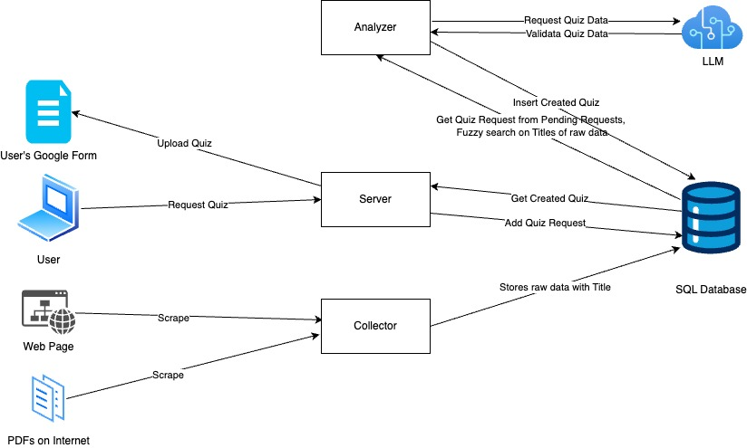

# Foundations of Software Team 1, Quiz Making API
Mohammed Raihan Ullah, Nikhil Bailey, Vinay Rajesh, Darshan Vijayaraghavan, Onkar Apte, Jyotirmoy Karmakar.


## About this Project
Our project scrapes and collects documents from the web to generate quizzes on demand. The application leverages the capabilities of LLMs to create quiz questions based on the scraped data and user prompts. It then uses the Google Forms API to publish the generated quizzes on Google Forms.

## Architecture Overview


## Cloud Architecture


## Technology stack

This codebase is written [Typescript](https://www.typescriptlang.org/) and uses [Express](https://expressjs.com/)
and [Mustache Templates](https://mustache.github.io/).
The frontend UI is written in [React](https://react.dev/).
It stores data in [PostgreSQL](https://www.postgresql.org/), and a [GitHub Action](https://github.com/features/actions)
runs tests.

## Architecture
 
The application consists of three main components communicating through a PostgreSQL database:  

#### 1. Collector (Data Collector)  
A background process that scrapes and collects documents from various web sources, including web pages and PDFs, storing the raw data with titles in the database.  

#### 2. Analyzer (Data Analyzer)  
Another background process that processes the collected data. It leverages LLMs to generate quiz questions based on scraped content and user prompts. It also validates quiz data before storing it.  

#### 3. Server (Web Application)  
The central component that handles user interactions. It allows users to request quizzes, retrieves generated quizzes from the database, and invokes the Google Forms API to publish quizzes on Google Forms.  

All components communicate through the SQL database, where raw data, quiz requests, and generated quizzes are stored.

## Deployment Method

The application is currently deployed on Cloud Run using a container image stored in Google Artifact Registry. The deployment process begins with authentication via the Google Cloud CLI, followed by building and pushing the Docker image of the main application to the designated Artifact Registry repository. This image is then used to deploy the service on Cloud Run. All related commands and steps are documented in the `Deployment Commands` file within the project repository.

## Major Design Changes

 The current deployment process uses Google Cloud Run to host a Dockerized application, with the image built locally, pushed to Google Artifact Registry, and then deployed as a publicly accessible service. However, major architectural changes are planned: the deployment will soon transition to Google Kubernetes Engine (GKE), where individual containers for the collector, analyzer, and the main web application will be orchestrated. This new deployment pipeline will be automated using GitHub Actions, enabling continuous integration and delivery for the entire system.

## Team Coordination Process

Regarding our coordination process, we mainly kept ourselves updated with weekly meeting (online or in-person). We share all of our progresses and also discuss if any problem if someone encountered. We tried to fix it as soon as possible either on a meet or by meeting in person. This mix of schedule meetings and flexible communication helped us to stay organised, resolve problems and blockers quickly, and keep the workflow smooth.

## Work Distribution Method

We divided tasks based on each team member’s strengths and interests. Raihan focused on the app flow, refining the idea, and integrating the Google Forms API. Myself and Darshan handled cloud architecture, CI/CD, and deployment to GCP. Nikhil worked on authentication and frontend development, while Onkar and Vinay were responsible for scraping websites, parsing, and storing the data. This clear division of work allowed us to work efficiently in parallel.

## Local development

1.  Install [node](https://formulae.brew.sh/formula/node) and [PostgreSQL 17](https://formulae.brew.sh/formula/postgresql@17).
    ```shell
    brew install node postgresql@17
    brew services run postgresql@17
    ```

1.  Set up environment variables.
    ```shell
    cp .env.example .env 
    source .env
    ```

1.  Set up the database.
    ```shell
    psql postgres < databases/create_databases.sql
    npm run migrate
    DATABASE_URL="postgresql://localhost:5432/capstone_starter_test?user=capstone_starter&password=capstone_starter" npm run migrate
    ```

1.  Run tests.
    ```shell
    npm run test
    ```

1.  Run the collector and the analyzer to populate the database, then run the app and navigate to
    [localhost:8787](http://localhost:8787).
    ```shell
    npm run collect
    npm run analyze
    npm run start
    ```

## Create a database schema migration

Use knex to create a database schema migration.

```shell
npx knex migrate:make "[Description of change]" --knexfile databases/knexfile.js
```

## Build container

1.  Build container
    ```shell
    npm run build
    docker build -t capstone-starter .
    ```

1.  Run with docker
    ```shell
    docker run --env-file .env.docker --entrypoint ./collect.sh capstone-starter
    docker run --env-file .env.docker --entrypoint ./analyze.sh capstone-starter
    docker run -p 8787:8787 --env-file .env.docker capstone-starter
    ```   
