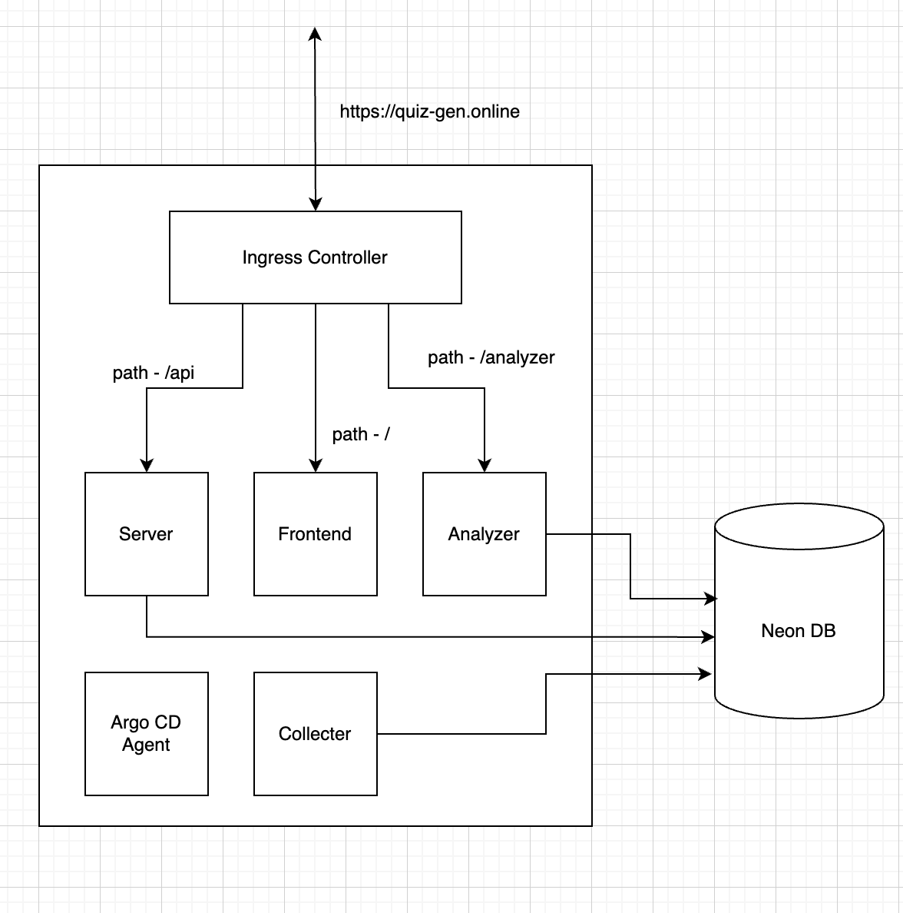
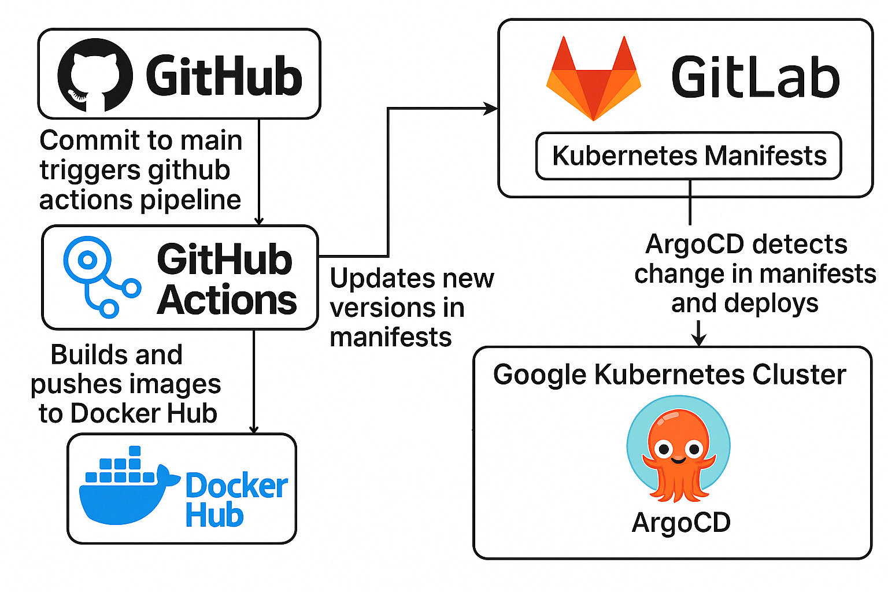

# Foundations of Software Team 1, Quiz Making API

Mohammed Raihan Ullah, Nikhil Bailey, Vinay Rajesh, Darshan Vijayaraghavan, Onkar Apte, Jyotirmoy Karmakar.

## About this Project

Our project scrapes and collects documents from the web to generate quizzes on demand. The application leverages the capabilities of LLMs to create quiz questions based on the scraped data and user prompts. It then uses the Google Forms API to publish the generated quizzes on Google Forms.

## Architecture Overview


## Cloud Architecture



## Technology stack

This codebase is written [Typescript](https://www.typescriptlang.org/) and uses [Express](https://expressjs.com/)
and [Mustache Templates](https://mustache.github.io/).
The frontend UI is written in [React](https://react.dev/).
It stores data in [PostgreSQL](https://www.postgresql.org/), and a [GitHub Action](https://github.com/features/actions)
runs tests.

## Componenent Explanation

The application consists of three main components communicating through a PostgreSQL database:

#### 1. Collector (Data Collector)

A background process that scrapes and collects documents from various web sources, including web pages and PDFs, storing the raw data with titles in the database.

#### 2. Analyzer (Data Analyzer)

Another background process that processes the collected data. It leverages LLMs to generate quiz questions based on scraped content and user prompts. It also validates quiz data before storing it.

#### 3. Server (Web Application)

The central component that handles user interactions. It allows users to request quizzes, retrieves generated quizzes from the database, and invokes the Google Forms API to publish quizzes on Google Forms.

All components communicate through the SQL database, where raw data, quiz requests, and generated quizzes are stored.

## CI/CD Explanation




The application is currently deployed on Cloud Run using a container image stored in Google Artifact Registry. The deployment process begins with authentication via the Google Cloud CLI, followed by building and pushing the Docker image of the main application to the designated Artifact Registry repository. This image is then used to deploy the service on Cloud Run. All related commands and steps are documented in the `Deployment Commands` file within the project repository.

## Team Coordination Process

Regarding our coordination process, we mainly kept ourselves updated with weekly meeting (online or in-person). We share all of our progresses and also discuss if any problem if someone encountered. We tried to fix it as soon as possible either on a meet or by meeting in person. This mix of schedule meetings and flexible communication helped us to stay organised, resolve problems and blockers quickly, and keep the workflow smooth.

## Work Distribution Method

We divided tasks based on each team member's strengths and interests. Raihan focused on the app flow, refining the idea, and integrating the Google Forms API. Myself and Darshan handled cloud architecture, CI/CD, and deployment to GCP. Nikhil worked on authentication and frontend development, while Onkar and Vinay were responsible for scraping websites, parsing, and storing the data. This clear division of work allowed us to work efficiently in parallel.

## Testing

We implemented both automatic and user acceptance testing. Automatic testing is done through the following files:

[Database Test Support](src/testSupport/databaseTestSupport.ts)

[Analyzer Test Support](src/testSupport/analyzerTestSupport.test.ts)

[Collector Test Support](collector/src/collectorTestSupport.test.ts)

These can be executed by running `npm test` once in **both the main directory and the collector subdirectory** (which has it's own package.json file). Note that for some of these tests, the developer must first spin up the database and set the GOOGLE_CLIENT_ID field in process.env.

Transcripts of both of our user acceptance tests can be found in this file:

[User Acceptance Transcripts](userAcceptanceTranscripts.txt)

## Local development

1.  Install [node](https://formulae.brew.sh/formula/node) and [PostgreSQL 17](https://formulae.brew.sh/formula/postgresql@17).

    ```shell
    brew install node postgresql@17
    brew services run postgresql@17
    ```

1.  Set up environment variables.

    ```shell
    cp .env.example .env
    source .env
    ```

1.  Set up the database.

    ```shell
    psql postgres < databases/create_databases.sql
    npm run migrate
    DATABASE_URL="postgresql://localhost:5432/capstone_starter_test?user=capstone_starter&password=capstone_starter" npm run migrate
    ```

1.  Run tests.

    ```shell
    npm run test
    ```

1.  Run the collector and the analyzer to populate the database, then run the app and navigate to
    [localhost:8787](http://localhost:8787).
    ```shell
    npm run collect
    npm run analyze
    npm run start
    ```

## Create a database schema migration

Use knex to create a database schema migration.

```shell
npx knex migrate:make "[Description of change]" --knexfile databases/knexfile.js
```

## Build container

1.  Build container

    ```shell
    npm run build
    docker build -t capstone-starter .
    ```

1.  Run with docker
    ```shell
    docker run --env-file .env.docker --entrypoint ./collect.sh capstone-starter
    docker run --env-file .env.docker --entrypoint ./analyze.sh capstone-starter
    docker run -p 8787:8787 --env-file .env.docker capstone-starter
    ```

## Running the Application

### API Server

To run the backend API server:

```bash
# Clean and build the project
npm run clean && npm run build

# Start the API server
npm run start
```

The API server will run on http://localhost:8080

### React Frontend

To run the React frontend development server:

```bash
# Navigate to the React app directory
cd src/views/react

# Install dependencies (first time only)
npm install

# Start the development server
npm start
```

The React app will be available at http://localhost:3000 and will automatically proxy API requests to the backend server.

# Built on: Capstone Starter

## Quick Start Guide

### Installation

To install all required dependencies for both backend and frontend:

```bash
# Install all dependencies both backend and frontend
npm run install:all
```

### Running the Application

#### Development Mode (Recommended)

To run both the backend server and frontend in development mode with hot reloading:

```bash
# Start both the backend server and frontend concurrently
npm run dev
```

This will start:

- Backend server on http://localhost:8080
- Frontend development server on http://localhost:3000

#### Running Separately

##### Backend Server

To run only the backend API server:

```bash
# Start the backend server
npm run dev:server
```

The API server will run on http://localhost:8080

##### Frontend Development

To run only the React frontend development server:

```bash
# Start the frontend development server
npm run dev:frontend
```

The React app will be available at http://localhost:3000 and will automatically proxy API requests to the backend server.

### Building and Running in Production

#### Step 1: Build the Project

```bash
# Clean the build directory
npm run clean

# Build the TypeScript backend
npm run build

# Build the React frontend
cd src/views/react
npm run build
cd ../../..
```

#### Step 2: Start the Production Server

```bash
# Start the production server
npm start
```

The production server will:

- Serve the backend API on http://localhost:8080
- Serve the built React frontend from the same server

Note: Make sure all environment variables are properly set in your production environment.

### Running Tests

The project uses Vitest for testing. Here are the available test commands:

#### Running All Tests

```bash
# Run all tests once
npm run test

# Run tests in watch mode (automatically re-runs when files change)
npm run test:watch

# Run tests with coverage report
npm run test:coverage
```

#### Running Specific Tests

```bash
# Run only server tests
npm run test:server

# Run server tests in watch mode
npm run test:server:watch

# Run a specific test file
npm run test src/services/server/__tests__/googleFormService.test.ts
```

#### Test Coverage

To generate and view test coverage:

```bash
# Generate coverage report
npm run test:coverage

# The coverage report will be available in the directory
```

Note: Make sure all dependencies are installed before running tests:

```bash
npm install
```
